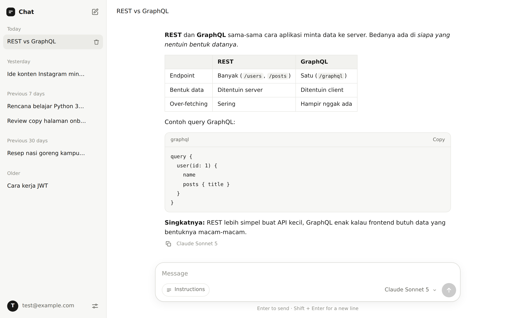

# Minimal Chat

Website chatbot minimalis: login, banyak chat, pilih model, history + konteks tersimpan di Supabase.
API key model **nggak pernah sampai ke browser**: disimpan di Edge Function secrets.



```
minimal-chat/
├── supabase/
│   ├── schema.sql              ← tabel + Row Level Security (jalankan sekali)
│   └── functions/chat/index.ts ← Edge Function: panggil model, stream balasan, simpan history
└── web/                        ← frontend statis (tanpa build)
    ├── index.html
    ├── style.css
    ├── app.js
    └── config.js               ← isi URL + key Supabase + daftar model di sini
```

## 1 API key buat semua model?

Tergantung key-nya dari mana:

| Key dari | Bisa pakai model apa | Yang perlu diubah |
|---|---|---|
| **OpenRouter** (default) | Claude, GPT, Gemini, DeepSeek, Llama, dll. Semuanya pakai 1 key | Nggak ada, langsung jalan |
| OpenAI | Cuma model OpenAI | `LLM_BASE_URL` + id model di `config.js` |
| Anthropic | Cuma Claude | `LLM_BASE_URL` + id model di `config.js` |
| Google AI Studio | Cuma Gemini | `LLM_BASE_URL` + id model di `config.js` |

Function-nya ngomong pakai format OpenAI-compatible `/chat/completions`, jadi semua provider di atas bisa. Kalau key-nya **bukan** OpenRouter, set secret `LLM_BASE_URL` dan ganti id model:

| Provider | `LLM_BASE_URL` | Contoh id model |
|---|---|---|
| OpenRouter | *(kosongin)* | `anthropic/claude-sonnet-5`, `openai/gpt-5.5`, `google/gemini-3.1-pro-preview` |
| OpenAI | `https://api.openai.com/v1` | `gpt-5.5`, `gpt-5.4-mini` |
| Anthropic | `https://api.anthropic.com/v1` | `claude-sonnet-5`, `claude-opus-5-5`, `claude-haiku-4-5` |
| Google Gemini | `https://generativelanguage.googleapis.com/v1beta/openai` | `gemini-3.1-pro-preview`, `gemini-3-flash-preview` |

Id model yang persis bisa dicek di dokumentasi provider masing-masing (OpenRouter: [openrouter.ai/models](https://openrouter.ai/models)).

---

## Setup (±15 menit, semua lewat Dashboard, nggak perlu install apa-apa)

### 1. Bikin project Supabase
[supabase.com/dashboard](https://supabase.com/dashboard) → **New project**. Tunggu sampai siap.

### 2. Bikin tabel
**SQL Editor** → **New query** → paste seluruh isi `supabase/schema.sql` → **Run**.
Harusnya muncul "Success". Tabel `chat_conversations`, `chat_messages`, dan `chat_settings` sekarang ada di **Table Editor**.

### 3. Deploy Edge Function
**Edge Functions** → **Deploy a new function** → **Via Editor**.
- Nama function: **`chat`** (harus persis ini)
- Hapus kode contoh, paste seluruh isi `supabase/functions/chat/index.ts` → **Deploy**
- Biarkan **Verify JWT** tetap **ON** (default)

### 4. Simpan API key
**Edge Functions** → **Secrets** → tambah:

| Name | Value |
|---|---|
| `LLM_API_KEY` | API key kamu |
| `ALLOWED_EMAILS` | email kamu (disarankan, biar cuma kamu yang bisa pakai kuota API-nya) |
| `LLM_BASE_URL` | *hanya kalau key-nya bukan OpenRouter* (lihat tabel di atas) |

Secret langsung aktif, nggak perlu deploy ulang.

### 5. Bikin akun kamu
**Authentication** → **Users** → **Add user** → **Create new user** → isi email + password, centang **Auto Confirm User**.

Setelah itu matikan pendaftaran publik: **Authentication** → **Sign In / Providers** → matikan **Allow new users to sign up**. Di `web/config.js` juga set `ALLOW_SIGN_UP = false`.

### 6. Isi `web/config.js`
Ambil dari **Project Settings** → **API Keys**:

```js
export const SUPABASE_URL = 'https://abcdefgh.supabase.co'
export const SUPABASE_PUBLISHABLE_KEY = 'sb_publishable_xxx' // atau legacy "anon" key
```

Dua nilai ini **aman ditaruh di frontend**: datanya dilindungi Row Level Security, dan API key model cuma ada di secrets.

### 7. Online-kan
Paling gampang: [app.netlify.com/drop](https://app.netlify.com/drop) → drag folder **`web`** → dapat URL. Bisa juga GitHub Pages / Vercel (semuanya file statis).

> Jangan buka `index.html` langsung dengan double-click (`file://`), karena browser nge-blok module JS. Harus lewat server, misalnya Netlify, atau lokal pakai `npx serve web` / ekstensi Live Server di VS Code.

Buka URL-nya → login → chat.

---

## Cara kerja history & konteks

Model AI itu **stateless**: tiap request dia lupa semuanya. Jadi tiap kamu kirim pesan, function-nya:

1. Simpan pesan kamu ke `chat_messages`
2. Ambil history chat itu dari database (default: 40 pesan terakhir, maksimal ±60.000 karakter)
3. Susun konteks: **system prompt** (termasuk tanggal hari ini) + **Custom instructions** (Settings, berlaku di semua chat) + **Instructions** chat ini (tombol di kolom ketik) + history
4. Kirim ke model, stream balasan ke browser, sambil **nyimpen balasan tiap ±2 detik**. Jadi kalau koneksi putus di tengah jalan, sebagian besar balasan tetap tersimpan

Pesan yang lebih lama dari batas di atas nggak ikut dikirim (masih tersimpan, cuma nggak masuk konteks). Buat topik baru, bikin chat baru: lebih murah dan jawabannya lebih fokus, karena tiap pesan ngirim ulang history-nya.

## Opsi (Edge Function secrets)

| Secret | Default | Fungsi |
|---|---|---|
| `LLM_API_KEY` | wajib | API key provider |
| `LLM_BASE_URL` | `https://openrouter.ai/api/v1` | Endpoint OpenAI-compatible |
| `ALLOWED_EMAILS` | semua user login | Daftar email yang boleh chat, pisah koma |
| `ALLOWED_MODELS` | semua | Batasi id model yang boleh dipakai, pisah koma |
| `DEFAULT_MODEL` | `anthropic/claude-sonnet-5` | Dipakai kalau browser nggak ngirim model |
| `SYSTEM_PROMPT` | asisten umum, jawab sesuai bahasa user | `{date}` diganti tanggal hari ini |
| `CONTEXT_MAX_MESSAGES` | `40` | Jumlah pesan terakhir yang jadi konteks |
| `CONTEXT_MAX_CHARS` | `60000` | Batas karakter history yang dikirim |
| `MAX_OUTPUT_TOKENS` | default provider | Batas panjang balasan |

Ganti/tambah model di picker: edit `MODELS` di `web/config.js` (model pertama = default).

## Keamanan

- API key model cuma ada di Edge Function secrets, nggak pernah dikirim ke browser.
- Row Level Security: tiap user cuma bisa baca/ubah chat miliknya sendiri.
- Function nolak request tanpa login, dan (kalau `ALLOWED_EMAILS` diisi) email yang nggak terdaftar.
- Output model di-sanitize sebelum ditampilkan, jadi HTML/script dari balasan nggak bisa jalan. Gambar di balasan ditampilkan sebagai link, bukan di-load otomatis.

## Kalau ada error

| Pesan | Artinya / solusinya |
|---|---|
| Layar "Almost there" | `web/config.js` belum diisi |
| "Run supabase/schema.sql in the SQL Editor first" | Langkah 2 belum dijalankan |
| "The "chat" Edge Function isn't deployed yet" | Langkah 3: nama function harus `chat` |
| "LLM_API_KEY is not set" | Langkah 4 |
| "Model API error 401 … Check the LLM_API_KEY secret" | Key salah, atau key bukan dari provider yang ada di `LLM_BASE_URL` |
| "… is not a valid model ID" / error 404 | Id model nggak cocok sama provider-nya (lihat tabel di atas) |
| "This account is not allowed to use this chat" | Email kamu belum ada di `ALLOWED_EMAILS` |
| "Your session has expired" | Sign out lalu login lagi |
| "The connection closed before the reply finished" | Balasan kelamaan. Edge Function di plan Free dibatasi 150 detik per request, dan bagian yang sudah keluar tetap tersimpan |

Log lengkap: **Edge Functions** → `chat` → **Logs**.

## Alternatif: deploy pakai CLI

Kalau lebih suka terminal (butuh Node.js):

```bash
npx supabase login
npx supabase functions deploy chat --project-ref <project-ref>
npx supabase secrets set LLM_API_KEY=xxx ALLOWED_EMAILS=kamu@email.com --project-ref <project-ref>
```

`<project-ref>` = bagian `abcdefgh` dari URL project. Schema tetap paling gampang dijalankan lewat SQL Editor.
